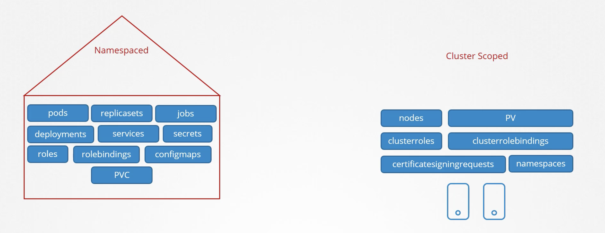

> RBAC는 사용자 또는 서비스 계정에 특정 역할을 부여하여, 그 역할에 따라 쿠버네티스 리소스에 대한 접근 권한을 제어하는 방식이다.

## 1.  Role 또는 ClusterRole 생성
- **Role** : 특정 네임스페이스에 속한 리소스에 대한 접근 권한을 정의한다.
- **ClusterRole** : 클러스터 전체 범위의 리소스에 대한 접근 권한을 정의한다.

```yaml
kind: Role
apiVersion: rbac.authorization.k8s.io/v1
metadata:
  namespace: default
  name: pod-reader
rules:
- apiGroups: [""]
  resources: ["pods"]
  verbs: ["get", "watch", "list"]
```

- default 네임스페이스에서 파드를 조회(get, watch, list)할 수 있는 권한을 가진 pod-reader라는 Role을 생성한다.

## 2. RoleBinding 또는 ClusterRoleBinding 생성

```yaml
kind: RoleBinding
apiVersion: rbac.authorization.k8s.io/v1
metadata:
  name: read-pods
  namespace: default
subjects:
- kind: User
  name: jane
  apiGroup: rbac.authorization.k8s.io
roleRef:
  kind: Role
  name: pod-reader
  apiGroup: rbac.authorization.k8s.io
```

- default 네임스페이스의 pod-reader Role을 사용자 jane에게 할당하는 RoleBinding을 생성한다. 이로써 jane은 해당 네임스페이스에서 파드를 조회할 수 있는 권한을 갖게 된다.

## 3. 사용자 인증 정보 설정
RBAC를 통한 권한 할당 이후에는 사용자 인증 정보를 쿠버네티스 클러스터와 연동해야 한다. 사용자는 kubeconfig 파일에 자신의 인증 정보(예: 클라이언트 인증서, 베어러 토큰 등)를 설정하여 kubectl과 같은 클라이언트 도구를 사용할 때 해당 인증 정보를 통해 클러스터에 접근할 수 있다.

--- 

### namespace scope vs cluster scope



- 하위 resources 에 대한 권한을 부여하고 싶은 경우 위 scope 에 따라 role 혹은 cluster role 을 구분하여 생성한다.
- cluster role 로 pod 에 대한 권한을 주는 경우, cluster 내 모든 pod 에 대한 권한이 생긴다.